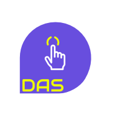

 

  

<h2 align="center">
<a href="#" rel="noopener" target="_blank">Digitized Attendance System</a>
</h2>

  An upgradation of the previously used ordinary human resource based attendance management.

 
 

### 🤝 Contributing

Well you can contribute to this repository in many ways:
-  Suggest changes/features you want in future releases.
-  Fork the repository, make some additional changes and send me a pull request. 
-  If there's any issues, please ask them and if you're too good to be good, than you can even rectify those issues on your own.
-  Documenting your code is always a good habit. It enhances your code quality and reduces stress of other developers working on your project.

 
 

### ⚖️ License

This project is licensed under the MIT License - see the [LICENSE](../blob/main/LICENSE) file for details